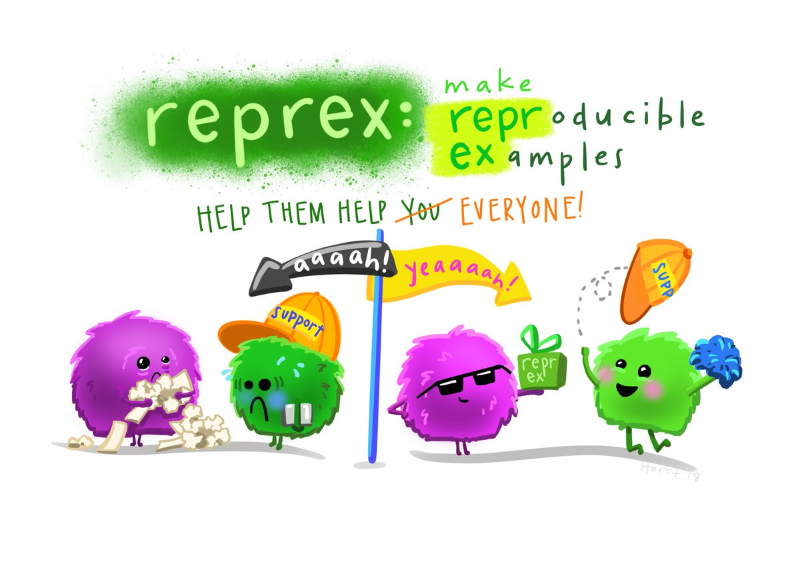

```{r setup, include=FALSE}
options(htmltools.dir.version = FALSE)
knitr::opts_chunk$set(
  fig.width = 9, fig.height = 3.5, fig.retina = 3,
  out.width = "100%",
  cache = FALSE,
  echo = TRUE,
  message = FALSE, 
  warning = FALSE,
  hiline = TRUE
)
```

```{r xaringanExtra-share-again, echo=FALSE}
xaringanExtra::use_share_again()
```

```{r xaringan-themer, include = FALSE, warning = FALSE}
# load package
library(xaringanthemer)

# set accent theme
style_mono_accent(
  header_font_google = google_font("Nunito Sans"), # Sanchez
  text_font_google = google_font("Glacial Indifference", "300", "300i"),
  code_font_google = google_font("Fira Mono"),
  base_color = "#05859B",
  white_color = "#93C6C2", 
  background_color = "#FFFFFF",
  link_color = "#9b0546",
  text_bold_color = "#05859B",
  header_font_weight = 400,
  header_h1_font_size = "2.25rem",
  header_h2_font_size = "1.75rem",
  header_h3_font_size = "1.5rem",
  footnote_font_size = "0.7em",
)
```


class: inverse, middle

# Teach Me How to `r fontawesome::fa("google", fill = "#93C6C2", a11y = "sem")`oogle<br>

<br>

<span style = 'font-size: 130%;'>Sam Csik | Data Training Coordinator</span>  

National Center for Ecological Analysis & Synthesis<br>

<br>

<span style = 'font-size: 130%;'>Master of Environmental Data Science | Summer 2022</span>   

Slides & source code available on [`r fontawesome::fa("github", fill = "#93C6C2", a11y = "sem")`](https://github.com/UCSB-MEDS/teach-me-how-to-google)

---

### Welcome to data science, where questions are aplenty!

.pull-left[

`r fontawesome::fa("angle-right", fill = "#05859B", a11y = "sem")` You will become increasingly more comfortable with **not immediately knowing** the answers to all your coding problems. It's all part of the job.

<br>

`r fontawesome::fa("angle-right", fill = "#05859B", a11y = "sem")` If it's not already, **Google** will become one of your best friends.

<br>

`r fontawesome::fa("angle-right", fill = "#05859B", a11y = "sem")` Googling is hard, and it is a skill that requries **practice.** But you **can** and **will** get better at it over time.

]


.pull-right[
```{r, out.width = '120%', echo = FALSE, fig.alt = "A gif of Seth Meyers sitting at the desk of his show, Late Night, and saying 'I have a lot of questions.'"}
knitr::include_graphics("media/questions.gif")
```
]
.pull-right[
.center[
<span style = 'font-size: 85%;'>-Me, everytime I open RStudio</span>
]
]

---
 ### It doesn't mean you won't still feel like this at times:
 
.center2[
```{r, out.width = '100%', out.height = '100%', echo = FALSE, fig.alt = "A gif of Ron Swanson, from the comedy TV series, Parks and Recreation, getting angry at his computer then taking it outside to toss in a dumpster."}
knitr::include_graphics("media/ron_swanson.gif")
```
.center[
<span style = 'font-size: 85%;'>-Me still, about half the times I open RStudio</span>
]
]

---

### But the goal is to be a bit more at peace with that feeling...and have the confidence that you can find your way

<br>

.center2[
```{r, out.width = '100%', echo = FALSE, fig.alt = "A cartoon drawing of an x- and y-axis plot, where the x-axis represents 'time' and the y-axis represents 'how much I know about R'. A round cartoon creature is moving through time (i.e. to the right across the x-axis). At time point one, when this creature is first beginning to learn R, it knows very little and it's facial expression suggests that it feels very intimidated. Over time, it experiences some highs and some lows. At time point eight (which is the furthest point to the right along the x-axis) this creature again feels like it knows very little about R, but instead of seeming intimidated as it did at time point one, it appears to be excited, suggesting a new sense of confidence."}
knitr::include_graphics("media/how_much_i_know.jpeg")
```
.center[
<span style = 'font-size: 85%;'>Artwork by [@allison_horst](https://twitter.com/allison_horst?lang=en)
]
]

---

### I typically find myself turning to Google for one of two reasons:

<br>

  <span style = 'font-size: 120%;'>`r fontawesome::fa("exclamation-triangle", fill = "#05859B", a11y = "sem")`  I got an error and need help fixing it</span>
  
  <br>
  
  <span style = 'font-size: 120%;'>`r fontawesome::fa("question-circle", fill = "#05859B", a11y = "sem")` I know what I want my code to do, but I have no idea how to actually pull it off</span>
  
<br>

--
  
  <span style = 'font-size: 120%;'>`r fontawesome::fa("flushed", fill = "#05859B", a11y = "sem")` Sometimes, it's both of these things happening at the same time</span>
  
---
class: inverse, middle, center

## `r fontawesome::fa("exclamation-triangle", fill = "#93C6C2", a11y = "sem")`  I got an error and need help fixing it

---

### Pause, exhale, narrow down your potential Google search

<br>

--

<span style = 'font-size: 120%;'>`r fontawesome::fa("power-off", fill = "#05859B", a11y = "sem")`  Restart R</span>

--

<br>

<span style = 'font-size: 120%;'>`r fontawesome::fa("lightbulb", fill = "#05859B", a11y = "sem")`  Check the easy stuff</span>

--

<br>


<span style = 'font-size: 120%;'>`r fontawesome::fa("exclamation-triangle", fill = "#05859B", a11y = "sem")`  Read that error message!</span>

--

<br>

<span style = 'font-size: 120%;'>`r fontawesome::fa("file-alt", fill = "#05859B", a11y = "sem")`  Double-check the documentation</span>

--

<br>

<span style = 'font-size: 120%;'>`r fontawesome::fa("earlybirds", fill = "#05859B", a11y = "sem")`  Talk about it out loud</span>

---

### <span style = 'font-size: 120%;'>`r fontawesome::fa("power-off", fill = "#05859B", a11y = "sem")`  Restart R</span>

.center[
>"Restart R often, especially when things get weird...We install and update packages from R, which is a little bit like working on your airplane engine while you're flying."

.right[
<span style = 'font-size: 60%;'>-Jenny Bryan, in her 2020 RSTUDIO::CONF keynote, [Object of type ‘closure’ is not subsettable](https://www.rstudio.com/resources/rstudioconf-2020/object-of-type-closure-is-not-subsettable/)</span>
]
]

<br>

--

.center[
Similarly, going to sleep and trying again tomorrow is a legitimate (and often impactful) strategy -- think of it as restarting your own internal computer (i.e. your brain).
]

<blockquote class="twitter-tweet tw-align-center"><p lang="en" dir="ltr">I love waking up and jumping back into solving a bug and immediately solving it with a fresh mind. Sleep is my favorite coding tool.</p>&mdash; Kelly Vaughn (@kvlly) <a href="https://twitter.com/kvlly/status/1385573317277532162?ref_src=twsrc%5Etfw">April 23, 2021</a></blockquote> <script async src="https://platform.twitter.com/widgets.js" charset="utf-8"></script>


???

Common reason why things get funky in a way that makes it difficult to debug and understand. The good thing is that you don't have to. Quit, restart!

---

### <span style = 'font-size: 120%;'>`r fontawesome::fa("lightbulb", fill = "#05859B", a11y = "sem")`  Check the easy stuff</span>

<br>

.center[
```{r echo = FALSE, out.width = '70%'}
knitr::include_graphics("media/debug_bingo.png")
```
]

.center[
<span style = 'font-size: 75%;'>Source: This [tweet](https://twitter.com/cogscimom/status/1354508785365078016?ref_src=twsrc%5Etfw) by [@cogscimom](https://twitter.com/cogscimom).</span>
]

---

### <span style = 'font-size: 120%;'>`r fontawesome::fa("exclamation-triangle", fill = "#05859B", a11y = "sem")`  Read that error message!</span>

**Helpful:** 
```{r, eval = TRUE, error = TRUE}
library(tidyverse)
library(palmerpenguins)

# take a look at the data
head(penguins, 3)
```

--

```{r, eval = TRUE, error = TRUE}
# what species are in this dataset?
unique(penguins$species)
```

--

```{r, eval = TRUE, error = TRUE, highlight.output = 3:4}
# filter for just "Gentoo" penguins
gentoo <- penguins %>% 
  filter(species = "Gentoo")
```

???

Revisit A.Horst's lab materials from EDS 221: https://allisonhorst.github.io/EDS_221_programming-essentials/interactive_sessions/day_9_interactive.html#2_Basics_-_troubleshooting_practice__tips

---

### <span style = 'font-size: 120%;'>`r fontawesome::fa("exclamation-triangle", fill = "#05859B", a11y = "sem")`  Read that error message!</span>

**Somewhat less helpful:**
```{r eval = TRUE, error = TRUE}
# create data object, 'dat'
dat <- data.frame(x = 1, y = 2)
dat
```

.footnote[
<span style = 'font-size: 80%;'>Example from Jenny Bryan's 2020 RSTUDIO::CONF keynote, [Object of type ‘closure’ is not subsettable](https://www.rstudio.com/resources/rstudioconf-2020/object-of-type-closure-is-not-subsettable/).
]

--

```{r eval = TRUE, error = TRUE, highlight.output = c(1)}
# extract column 'x' from your data object
df$x
```

--

<span style = 'font-size: 65%;'>If you feel incredibly frustrated by this error, well, welcome to the club! Jenny Bryan writes:</span> 

> <span style = 'font-size: 65%;'>Your first “object of type ‘closure’ is not subsettable” error message is a big milestone for an R user. Congratulations, if there was any lingering doubt, you now know that you are officially programming!</span>

<span style = 'font-size: 65%;'>This error often arises when you attempt to subset a function (i.e. treat a function in a way that it is shouldn't be). Here, we forgot that we called called our object `dat`, and not `df`. `df()` also happens to be a function that gives you the density of the 'F' distribution and we are attempting to subset a column (`x`) from it.</span>

???

Revisit A.Horst's lab materials from EDS 221: https://allisonhorst.github.io/EDS_221_programming-essentials/interactive_sessions/day_9_interactive.html#2_Basics_-_troubleshooting_practice__tips

---

### <span style = 'font-size: 120%;'>`r fontawesome::fa("exclamation-triangle", fill = "#05859B", a11y = "sem")`  Read that error message!</span>

Check out some of these additional resources for common R error messages and strategies for fixing them:

  * [Common R Error Messages](https://www.programmingr.com/r-error-messages/), on [ProgrammingR](https://www.programmingr.com/)
    
  * [Common R Programming Errors Faced by Beginners](https://www.r-bloggers.com/2016/06/common-r-programming-errors-faced-by-beginners/), on [R-bloggers](https://www.r-bloggers.com/)
    
  * [R Error Message Cheat Sheet](http://varianceexplained.org/courses/errors/), by David Robinson on his blog, [Variance Explained](http://varianceexplained.org/)
    
  * [How to: Interpret Common Errors in R](https://warin.ca/posts/rcourse-howto-interpretcommonerrors/), by [Thierry Warin](https://warin.ca/)
---

### <span style = 'font-size: 120%;'>`r fontawesome::fa("file-alt", fill = "#05859B", a11y = "sem")`  Double-check the documentation</span>

<span style = 'font-size: 75%;'>While documentation can sometimes be tricky to read, it provides critical info for understanding how to use a package or function.</span>

<span style = 'font-size: 75%;'>Access the documentation for any loaded package or function by either typing `?function_name` or `help(function_name)` in your console. If you search for a function from a package that is not currently loaded, R will prompt you to type `??function_name`.</span>

--

<span style = 'font-size: 75%;'>Some important components:</span>

  <span style = 'font-size: 65%;'>`r fontawesome::fa("angle-right", fill = "#05859B", a11y = "sem")` **Usage:** shows the various arguments to need to specify. Some are necessary, some are optional. Default values are shown here.</span>
  
  <span style = 'font-size: 65%;'>`r fontawesome::fa("angle-right", fill = "#05859B", a11y = "sem")` **Arguments:** briefly describes what each argument is/takes as a value</span> 

  <span style = 'font-size: 65%;'>`r fontawesome::fa("angle-right", fill = "#05859B", a11y = "sem")` **Value:** describes the output of a function</span> 

  <span style = 'font-size: 65%;'>`r fontawesome::fa("angle-right", fill = "#05859B", a11y = "sem")` **See Also:** related functions</span> 

  <span style = 'font-size: 65%;'>`r fontawesome::fa("angle-right", fill = "#05859B", a11y = "sem")` **Examples:** code snippets to show you how a function is used in practice</span>

--

<span style = 'font-size: 75%;'>Some packages will also have **vignettes**, which provide more detailed descriptions of how functions within a package should be used. Googling `package_name vignette` will usually get you there (e.g. check out the [dplyr vignette](https://cran.r-project.org/web/packages/dplyr/vignettes/dplyr.html)).</span>
    
---

### <span style = 'font-size: 120%;'>`r fontawesome::fa("earlybirds", fill = "#05859B", a11y = "sem")`  Talk about it *out loud*</span>

.pull-left[
This is often referred to as **rubber duck debugging**, and it goes something like this:

> <span style = 'font-size: 55%;'>*1. Beg, borrow, steal, buy, fabricate or otherwise obtain a rubber duck (bathtub variety).*</span> 

> <span style = 'font-size: 55%;'>*2. Place rubber duck on desk and inform it you are just going to go over some code with it, if that’s all right.*</span>

> <span style = 'font-size: 55%;'>*3. Explain to the duck what your code is supposed to do, and then go into detail and explain your code **line by line**.*</span> 

> <span style = 'font-size: 55%;'>*4. At some point you will tell the duck what you are doing next and then realise that that is not in fact what you are actually doing. The duck will sit there serenely, happy in the knowledge that it has helped you on your way.*</span> 
.right[
<span style = 'font-size: 50%;'>- [rubberduckdebugging.com](https://rubberduckdebugging.com/) with original credit to Andy from lists.ethernal.org</span>
]
]

.pull-right[
```{r echo = FALSE, out.width = '100%'}
knitr::include_graphics("media/duck.jpeg")
```
.center[
<span style = 'font-size: 75%;'>Source: [Wikipedia](https://en.wikipedia.org/wiki/Rubber_duck_debugging)</span>
]
]

???

I'll also note that I tend to combine this 'rubber ducky debugging' method with actually running my code line-by-line.

---
### Still haven't figured it out? Enter Google.

<span style = 'font-size: 100%;'>`r fontawesome::fa("google", fill = "#05859B", a11y = "sem")`  General Googling tips:</span>

  - <span style = 'font-size: 75%;'>[r] + error message</span>
  - <span style = 'font-size: 75%;'>error message + function or package name</span>
  - <span style = 'font-size: 75%;'>sometimes even just the error message alone with suffice</span>

--

<span style = 'font-size: 100%;'>`r fontawesome::fa("github-square", fill = "#05859B", a11y = "sem")`  Explore package source code on GitHub</span>
 
  - <span style = 'font-size: 75%;'>this may include looking at any issues or pull requests associated with that package to check if there are known problems (e.g. check out `xaringan` on [GitHub](https://github.com/yihui/xaringan))</span>
  - <span style = 'font-size: 75%;'>check to see if there are wikis available for a particular repository (e.g. I was able to figure out how to wrap code output on `xaringan` slides thanks to one of their [wikis](https://github.com/yihui/xaringan/wiki/Word-wrapping-of-code-output))</span>

--

<span style = 'font-size: 100%;'>`r fontawesome::fa("calendar", fill = "#05859B", a11y = "sem")`  Check the date of online solutions</span>

  - <span style = 'font-size: 75%;'>past solutions can become outdated quickly -- target recent posts and responses</span>
  
--

<span style = 'font-size: 100%;'>`r fontawesome::fa("plus", fill = "#05859B", a11y = "sem")`  Read multiple search results</span>

  - <span style = 'font-size: 75%;'>sometimes one explanation will make sense in a way that another explanation will not</span>
  
--

<span style = 'font-size: 100%;'>`r fontawesome::fa("user-secret", fill = "#05859B", a11y = "sem")`  Isolate the relevant part(s) of an answer</span>

  - <span style = 'font-size: 75%;'>not every part of an online response will be relevant to *your* problem -- take care when copying/pasting entire "solutions"</span>
  
???

James Frew posted in the eds-223 channel on Monday, October 4, 2021: 

- Reminder: anytime you get an unusually cryptic error message, it doesn't hurt to just cut-n-paste a reasonably-specific chunk of the message into Google.

- For example, one of you contacted me about an error message whose last line was: `function 'Rcpp_precious_remove' not provided by package 'Rcpp'`

- That looked reasonably-specific (i.e., likely to retrieve something useful, and unlikely to retrieve cat memes), so I Googled it: https://www.google.com/search?q=function+%27Rcpp_precious_remove%27+not+provided+by+package+%27Rcpp%27

- First hit was: https://stackoverflow.com/questions/68416435/rcpp-package-doesnt-include-rcpp-precious-remove which solved the problem.


---
## `r fontawesome::fa("stack-overflow", fill = "#05859B", a11y = "sem")` Refine your search on Stack Overflow

<span style = 'font-size: 90%;'>You're probably going to end up on Stack Overflow *often*. Increase your chances of finding a helpful answer by visiting their [How do I search?](https://stackoverflow.com/help/searching) page, which details all search operators.</span> 

<span style = 'font-size: 90%;'>You will also find a handy "cheat sheet" that suggests some of the more common search operators when you click into the search bar:</span>

<br>

.center[
```{r echo = FALSE, out.width = '65%'}
knitr::include_graphics("media/stackoverflow.png")
```
]

---

## Still stumped? Ask the community!


<span style = 'font-size: 75%;'>Create a `reprex` i.e. a **minimal reproducible example**. Strip away the cruft and present only what is required to reproduce your issue. Most of the time, this will help *you* solve your own problem. And if you still can't figure it out, you've helped the community help you.</span>

<span style = 'font-size: 75%;'>Check out [FAQ: How to do a minimal reproducible example (reprex) for beginners](https://community.rstudio.com/t/faq-how-to-do-a-minimal-reproducible-example-reprex-for-beginners/23061) and [Reprex do's and don'ts](https://reprex.tidyverse.org/articles/reprex-dos-and-donts.html) to get started on creating your first `reprex`.</span>

.center[
```{r echo = FALSE, out.width = '65%'}

```
.center[
<span style = 'font-size: 75%;'>Artwork by [@allison_horst](https://twitter.com/allison_horst?lang=en)</span>
]
]

---
class: inverse, middle, center

## `r fontawesome::fa("question-circle", fill = "#93C6C2", a11y = "sem")` I know what I want my code to do, but I have no idea how to actually pull it off

---
## Knowing *what* to search for is half the battle

.pull-left[
<blockquote class="twitter-tweet"><p lang="en" dir="ltr">The early hard part is just knowing the vocabulary. True beginners would have no reason to know what a join is. They might describe it as “looking up values from another table” which may not produce helpful results. So reading through a text book or intro class can give vocab</p>&mdash; JD Long (@CMastication) <a href="https://twitter.com/CMastication/status/1437827181476995072?ref_src=twsrc%5Etfw">September 14, 2021</a></blockquote> <script async src="https://platform.twitter.com/widgets.js" charset="utf-8"></script>
]

.pull-right[
<blockquote class="twitter-tweet"><p lang="en" dir="ltr">Maybe we need to just tell learners “read the book for both the concepts AND the vocabulary to ask questions” because I bet they don’t realize this at all.</p>&mdash; JD Long (@CMastication) <a href="https://twitter.com/CMastication/status/1437833818518528003?ref_src=twsrc%5Etfw">September 14, 2021</a></blockquote> <script async src="https://platform.twitter.com/widgets.js" charset="utf-8"></script>
]

---
## A curated **vocabulary list** of R terminology may help

`r fontawesome::fa("angle-right", fill = "#05859B", a11y = "sem")`  Hadley Wickham lists functions that he believes constitute a good working vocabulary for R fluency in his book, [Advanced R (first edition)](http://adv-r.had.co.nz/Vocabulary.html).

  - I would love to expand on this, with a focus on data wrangling and visualization. Ping me with ideas!
  
  - In the meantime, keeping a running vocab list for yourself might be massively helpful

`r fontawesome::fa("angle-right", fill = "#05859B", a11y = "sem")` Other resources include:

  - [R Functions List (+ Examples) | All Basic Commands of the R Programming Language](https://statisticsglobe.com/r-functions-list/), by Statistics Globe
  
---

## Use **search operators** to get more specific results

.pull-left[
```{r echo = FALSE, out.width = '97%'}
knitr::include_graphics("media/how_to_nytimes.png")
```
]

.pull-right[
```{r echo = FALSE, out.width = '90%'}
knitr::include_graphics("media/how_to_velocity.png")
```
]

.center[
<span style = 'font-size: 65%;'>Source: ‘Infographic: Get More Out Of Google.’ HackCollege. HackCollege, 23 Nov. 2011. Web. 30 July 2015.</span>
]

**For example, compare the following two Google queries:**

  **1.** <span style = 'font-family: "Fira Mono";'>r dplyr join</span>: [see results here](https://www.google.com/search?q=r+dplyr+join&oq=R+dplyr+join&aqs=chrome.0.0i512l6j69i60.2431j0j7&sourceid=chrome&ie=UTF-8)
  
  **2.** <span style = 'font-family: "Fira Mono";'>site:stackoverflow.com R "dplyr join"</span>: [see results here](https://www.google.com/search?q=site%3Astackoverflow.com+R+%22dplyr+join%22&oq=site%3Astackoverflow.com+R+%22dplyr+join%22&aqs=chrome..69i57j69i58.71866j0j7&sourceid=chrome&ie=UTF-8)

---

### It's also okay just to **copy code**

.pull-left[
<blockquote class="twitter-tweet"><p lang="en" dir="ltr">Jokes are only the beginning.<br><br>The Key is available now, and your programming will never be the same.<a href="https://t.co/KAjJ1DKenf">https://t.co/KAjJ1DKenf</a> <a href="https://t.co/gDiYvBPSqp">https://t.co/gDiYvBPSqp</a> <a href="https://t.co/bhrBJN8N1Y">pic.twitter.com/bhrBJN8N1Y</a></p>&mdash; Cassidy (@cassidoo) <a href="https://twitter.com/cassidoo/status/1442936000578154498?ref_src=twsrc%5Etfw">September 28, 2021</a></blockquote> <script async src="https://platform.twitter.com/widgets.js" charset="utf-8"></script>
]

.pull-right[
<blockquote class="twitter-tweet"><p lang="en" dir="ltr">It started as an April Fools prank, but the joke is officially over. The Key is now available for purchase worldwide from <a href="https://twitter.com/drop?ref_src=twsrc%5Etfw">@drop</a> with proceeds going to <a href="https://twitter.com/digundiv?ref_src=twsrc%5Etfw">@digundiv</a>. Check it out: <a href="https://t.co/rLQVdVn4ms">https://t.co/rLQVdVn4ms</a> <a href="https://t.co/rsO63pNd1B">pic.twitter.com/rsO63pNd1B</a></p>&mdash; Stack Overflow (@StackOverflow) <a href="https://twitter.com/StackOverflow/status/1442898486685364224?ref_src=twsrc%5Etfw">September 28, 2021</a></blockquote> <script async src="https://platform.twitter.com/widgets.js" charset="utf-8"></script>
]

???

Once you find a search result, it’s ok in the beginning to copy and paste without fully understanding what the code does. Over time, as you get better at coding, the code that other people post will make more sense.

---

class: inverse, middle, center

## `r fontawesome::fa("bug", fill = "#93C6C2", a11y = "sem")` Take proactive measures to make *your* code easier to debug

---

## Help future you *and* others by writing thoughtful code
--

<br>

<span style = 'font-size: 120%;'>`r fontawesome::fa("code", fill = "#05859B", a11y = "sem")`  Plan your approach by writing pseudocode</span>

--

<br>

<span style = 'font-size: 120%;'>`r fontawesome::fa("brain", fill = "#05859B", a11y = "sem")`  Use explaining variables</span>

--

<br>

<span style = 'font-size: 120%;'>`r fontawesome::fa("check", fill = "#05859B", a11y = "sem")`  Build in checks</span>

---

### <span style = 'font-size: 120%;'>`r fontawesome::fa("code", fill = "#05859B", a11y = "sem")`  Plan your approach by writing pseudocode</span>

<span style = 'font-size: 90%;'>[Pseudocode](https://en.wikipedia.org/wiki/Pseudocode) is a step-by-step written "outline" of your code that you can then transcribe into a programming language (in our case, likely R). It is written in plain language (e.g. English), but uses the structural conventions of a programming language.</span>

```{r echo = TRUE, eval = FALSE}
##~~~~~~~~~~~~~~~~~~~~~~~~~~~~~~~~~~~~~~~~~~~~~~~~~~~~~~~~~~~~~~~~~~~~~~~~~~~~~~
##                                  pseudocode                              ----
##~~~~~~~~~~~~~~~~~~~~~~~~~~~~~~~~~~~~~~~~~~~~~~~~~~~~~~~~~~~~~~~~~~~~~~~~~~~~~~

new_df <- original_data %>% 
  filter for gentoo penguins %>% 
  calculate bill length to depth ratio and add as new column 

##~~~~~~~~~~~~~~~~~~~~~~~~~~~~~~~~~~~~~~~~~~~~~~~~~~~~~~~~~~~~~~~~~~~~~~~~~~~~~~
##                                 actual code                              ----
##~~~~~~~~~~~~~~~~~~~~~~~~~~~~~~~~~~~~~~~~~~~~~~~~~~~~~~~~~~~~~~~~~~~~~~~~~~~~~~

penguins_new <- penguins %>% 
  filter(species == "Gentoo") %>% 
  mutate(bill_LD_ratio = bill_length_mm/bill_depth_mm) 

```

???

While pseudocode is often used for planning out more complex algorithms, practicing with simpler examples may help you to avoid making mistakes -- pseudocode forces you acknowledge what each line of your script is meant to do, before you even write any code.

---

### <span style = 'font-size: 120%;'>`r fontawesome::fa("brain", fill = "#05859B", a11y = "sem")`  Use explaining variables</span>

Code comments are great, but variable and function names that explain what they are/do are even better. 

.center[
> <span style = 'font-size: 80%;'>Because with code comments we end up with two parallel sources of truth - what the code is doing, and what the comment says. Over time these two sources of truth have a tendency to diverge.</span>

.right[
<span style = 'font-size: 60%;'>- Pete Hodgson, in his post, [Explaining Variable](https://blog.thepete.net/blog/2021/06/24/explaining-variable/)</span>
]
]

<blockquote class="twitter-tweet tw-align-center"><p lang="en" dir="ltr">A common suggestion I give during code review is to add an Explaining Variable. I couldn&#39;t find a good explanation of the pattern to link to, so I wrote one 🙃<a href="https://t.co/WRigu74gpu">https://t.co/WRigu74gpu</a></p>&mdash; Pete Hodgson (@ph1) <a href="https://twitter.com/ph1/status/1412125686974717971?ref_src=twsrc%5Etfw">July 5, 2021</a></blockquote> <script async src="https://platform.twitter.com/widgets.js" charset="utf-8"></script>

---

### <span style = 'font-size: 120%;'>`r fontawesome::fa("check", fill = "#05859B", a11y = "sem")`  Build in checks</span>

<span style = 'font-size: 70%;'>The function below converts a temperature between Celsius and Fahrenheit, and vice versa. It takes three arguments:</span>

  - <span style = 'font-size: 70%;'>`from`: a string, either "fahrenheit" or "celsius"</span> 
  - <span style = 'font-size: 70%;'>`to`: a string, either "fahrenheit" or "celsius"</span>
  - <span style = 'font-size: 70%;'>`temp`: a double, the temperature value to convert</span>
  
<span style = 'font-size: 70%;'>It is important to note that with the way this function is currently written, the `from` and `to` arguments only take the string values, "fahrenheit" or "celsius." What happens if the user accidentally misspells those values? We can make that easier to troubleshoot by building in an informative error message.</span>

```{r eval = FALSE, echo = TRUE}
convert_temp <- function(from, to, temp) {
  
  # if `from` is "celsius" and `to` is "fahrenheit"
  if(from == "celsius" & to == "fahrenheit") {
    converted_temp <- temp*1.8 + 32
    
    # if `from` is "fahrenheit" and `to` is "celsius"
    } else if(from == "fahrenheit" & to == "celsius") {
    converted_temp <- (temp - 32)/1.8
   
    # if inputs that don't match either of the first two conditionals are supplied, give warning and return NA 
  } else { #<<
      stop("The inputs provided (from = '", from, "' & to = '", to,"') are not as expected. Double check spelling.") #<<
      return(NA) #<<
    } #<<
  
  # return the converted value
  return(converted_temp)
}
```

---

### <span style = 'font-size: 120%;'>`r fontawesome::fa("check", fill = "#05859B", a11y = "sem")`  Build in checks</span>

```{r eval = TRUE, echo = FALSE}
convert_temp <- function(from, to, temp) {
  
  # if `from` is "celsius" and `to` is "fahrenheit"
  if(from == "celsius" & to == "fahrenheit") {
    converted_temp <- temp*1.8 + 32
    
    # if `from` is "fahrenheit" and `to` is "celsius"
    } else if(from == "fahrenheit" & to == "celsius") {
    converted_temp <- (temp - 32)/1.8
   
    # if inputs that don't match either of the first two conditionals are supplied, give warning and return NA 
   } else { 
      stop("The inputs provided (from = '", from, "' & to = '", to,"') are not as expected. Double check spelling.") #
      return(NA) 
    } 
  
  # return the converted value
  return(converted_temp)
}
```

<span style = 'font-size: 90%;'>Let's convert 90°F to °C:</span>

```{r, eval = TRUE, echo = TRUE, error = TRUE}
# try it out
convert_temp(from = "farenheit", to = "celsius", temp = 90)
```

--

<span style = 'font-size: 90%;'>Bummer, our code broke. But informative error message to the rescue! Seems like we may have a spelling error for the input values provided to either the `from` and/or `to` arguments. Let's fix and try again:</span>

--

```{r, eval = TRUE, echo = TRUE, error = TRUE}
# oops, misspelled "fahrenheit" - try again
convert_temp(from = "fahrenheit", to = "celsius", temp = 90)
```

---
### Google is now forever a part of your coding life...

.center[
<span style = 'font-size: 80%;'>...but with practice, you'll find better solutions faster. Keep at it!</span>
]

.center[
```{r echo = FALSE, out.width = '42%', out.height = '42%', fig.alt = "A meme with two stacked panels. The top panel depicts a stick figure taking one step forward only to step directly on a rake, which flips up to smack the stick figure in the face. The bottom panel depics a man 'skateboarding' down a set of outdoor stairs on a rake, performing tricks along the way. When he reaches the bottom of the stairs, he accidentally steps on the rake, which flips up to smack him in the face."}
knitr::include_graphics("media/rake.png")
```
.center[
<span style = 'font-size: 75%;'>- Twitter, source unknown</span>
]
]

---
class: center, middle

## `r fontawesome::fa("google", fill = "#05859B", a11y = "sem")`et `r fontawesome::fa("google", fill = "#05859B", a11y = "sem")`oogling 
```{r echo = FALSE, out.width = '60%'}
knitr::include_graphics("media/google.gif")
```

Slides created via the R packages:

[**xaringan**](https://github.com/yihui/xaringan)<br>
[**gadenbuie/xaringanthemer**](https://github.com/gadenbuie/xaringanthemer)

<span style = 'font-size: 75%;'>*If you see mistakes or want to suggest changes, please create an [issue](https://github.com/UCSB-MEDS/teach-me-how-to-google/issues) on the source repository.*</span>

---

class: inverse, middle, center

## `r fontawesome::fa("laptop-code", fill = "#93C6C2", a11y = "sem")` Practice problems

Copy and paste the following coding challenges into an R script or Rmd file. Problems may have more than one error or missing code (be mindful, you might not even get an error message) to identify and fix.  

More than one solution may exist for each problem -- I'd love to hear about the different ways people approach these, so please be prepared to share the steps (Googling, looking at documentation, reading error messages, etc.) you took with the class!  

*Remember:* running code line-by-line is one of the best ways to isolate errors. 

---
## Problem 1

**Goal:** You have two data sets, `a` and `b`. Each contain the same attributes (i.e. columns) -- `month`, `season`, and `daylight_savings`. Identify which records (i.e. rows of data) in data table `a` are not contained in data table `b`.

```{r, echo = TRUE, eval = FALSE}
a <- data.frame(month = c("October", "November", "December", "January", "February"),
                season = c("Fall", "Fall", "Winter", "Winter", "Winter"),
                daylight_savings = c("yes", "partly", "no", "no", "no"))

b <- data.frame(month = c("October", "December", "February"),
                season = c("Fall", "Winter", "Winter"),
                daylight_savings = c("yes", "no", "no"))
```

---
## Problem 1 (a solution)

**Goal:** You have two data sets, `a` and `b`. Each contain the same attributes (i.e. columns) -- `month`, `season`, and `daylight_savings`. Identify which records (i.e. rows of data) in data table `a` are not contained in data table `b`.

```{r, echo = TRUE, eval = TRUE}
a <- data.frame(month = c("October", "November", "December", "January", "February"),
                season = c("Fall", "Fall", "Winter", "Winter", "Winter"),
                daylight_savings = c("yes", "partly", "no", "no", "no"))

b <- data.frame(month = c("October", "December", "February"),
                season = c("Fall", "Winter", "Winter"),
                daylight_savings = c("yes", "no", "no"))

difference <- anti_join(a, b) #<<
difference
```

---
## Problem 2

**Goal:** Modify the following code such that it sorts any **blue** animals from the `animals` vector into the `blue_animals` vector.

```{r, echo = TRUE, eval = FALSE}
##~~~~~~~~~~~~~~~~~~~~~~~~~~~
##  ~ vector of animals  ----
##~~~~~~~~~~~~~~~~~~~~~~~~~~~

animals <- c("blue tang", "red panda", "Blue jay",
             "green sea turtle", "blue morpho butterfly", 
             "Blue iguana", "Red squirrel")

##~~~~~~~~~~~~~~~~~~~~~~~~~~~~~~~~~~~~~~~~~~~~~~~~~~~~~~~~~~~~~~~
##  ~ initialize empty vector to store blue-colored animals  ----
##~~~~~~~~~~~~~~~~~~~~~~~~~~~~~~~~~~~~~~~~~~~~~~~~~~~~~~~~~~~~~~~

blue_animals <- c()

##~~~~~~~~~~~~~~~~~~~~~~~~~~~~~~~~~~~~~~~~~~~~~~~
##  ~ sort blue animals into their own list  ----
##~~~~~~~~~~~~~~~~~~~~~~~~~~~~~~~~~~~~~~~~~~~~~~~

for (i in 1:length(animals)){
  
  current_animal <- animals[i]
  
  if(isTRUE(str_detect(current_animal, "blue"))){
    
    message("The '", current_animal, "' is a blue animal")
    
    blue_animals <- current_animal
    
  }
  
}

```

---

## Problem 2 (a solution)

**Goal:** Modify the following code such that it sorts any **blue** animals from the `animals` vector into the `blue_animals` vector.

```{r echo = TRUE, eval = FALSE}
##~~~~~~~~~~~~~~~~~~~~~~~~~~~
##  ~ vector of animals  ----
##~~~~~~~~~~~~~~~~~~~~~~~~~~~

animals <- c("blue tang", "red panda", "Blue jay",
             "green sea turtle", "blue morpho butterfly", 
             "Blue iguana", "Red squirrel")

##~~~~~~~~~~~~~~~~~~~~~~~~~~~~~~~~~~~~~~~~~~~~~~~~~~~~~~~~~~~~~~~
##  ~ initialize empty vector to store blue-colored animals  ----
##~~~~~~~~~~~~~~~~~~~~~~~~~~~~~~~~~~~~~~~~~~~~~~~~~~~~~~~~~~~~~~~

blue_animals <- c()

##~~~~~~~~~~~~~~~~~~~~~~~~~~~~~~~~~~~~~~~~~~~~~~~
##  ~ sort blue animals into their own list  ----
##~~~~~~~~~~~~~~~~~~~~~~~~~~~~~~~~~~~~~~~~~~~~~~~

for (i in 1:length(animals)){
  
  current_animal <- animals[i]
  
  if(isTRUE(str_detect(current_animal, "(?i)blue"))){ #<<
    
    message("The '", current_animal, "' is a blue animal")
    
    blue_animals <- append(blue_animals, current_animal) #<<
    
  }
  
}
```

---
## Problem 3 (slide 1/2)

**Goal:** Modify the following code (on slide 2/2) to recreate the plot below

.center[
```{r echo = FALSE, out.width = '75%'}
knitr::include_graphics("media/penguin_plot.png")
```
]

---
## Problem 3 (slide 2/2)

```{r echo = TRUE, eval = FALSE}

library(tidyverse)
library(palmerpenguins)

ggplot(data = penguins, aes(x = species, y = body_mass_g), shape = sex) +
  geom_point(alpha = 0.2, position = position_jitterdodge(dodge.width = 0.8)) + 

  # means & standard devs
  stat_summary(mapping = aes(color = species),
               fun = "mean", geom = "point", size = 4) +
  stat_summary(mapping = aes(color = species),
               fun = "mean", geom = "errorbar", size = 1, width = 0.2,
               fun.max = function(x) mean(x) + sd(x),
               fun.min = function(x) mean(x) - sd(x)) +

  # change colors/shapes
  scale_color_manual(values = c("#FF8C02", "#A93FF1", "#148F90"), name = "Species") + 
  scale_shape_manual(values = c(15, 16), name = "Sex") + 
  
  # add nicer axis labels + title + caption
  labs(x = "Penguin Species", 
       y = "Body Mass (g)",
       title = "Body mass of female vs. male adelie, chinstrap, and gentoo penguins",
       subtitle = "Colored points represent mean body mass (± SD)",
       caption = "Data Source: Dr. Kristen Gorman, LTER Palmer Station") +
 
  theme_classic() + 
  theme(
        plot.title = element_rect(hjust = 0, size = 14),
        axis.text = element_text(color = "black", size = 10),
        axis.title = element_rect(color = "black", size = 14),
        plot.caption = element_text(size = 7, hjust = 1, color = "gray", face = "italic"),
        panel.border = element_rect(color = "black", size = 0.7, fill = NA))
```

---
## Problem 3 (a solution)

```{r echo = TRUE, eval = FALSE}

library(tidyverse)
library(palmerpenguins)

ggplot(data = na.omit(penguins), aes(x = species, y = body_mass_g, shape = sex)) + #<<
  geom_point(alpha = 0.2, position = position_jitterdodge(dodge.width = 0.8)) + 

  # means & standard devs
  stat_summary(mapping = aes(color = species),
               fun = "mean", geom = "point", size = 4,
               position = position_dodge(width = 0.8)) + #<<
  stat_summary(mapping = aes(color = species),
               fun = "mean", geom = "errorbar", size = 1, width = 0.2,
               fun.max = function(x) mean(x) + sd(x),
               fun.min = function(x) mean(x) - sd(x),
               position = position_dodge(width = 0.8)) + #<<

  # change colors/shapes
  scale_color_manual(values = c("#FF8C02", "#A93FF1", "#148F90"), name = "Species") + 
  scale_shape_manual(values = c(15, 16), name = "Sex") + 
  
  # add nicer axis labels + title + caption
  labs(x = "Penguin Species", 
       y = "Body Mass (g)",
       title = "Body mass of female vs. male adelie, chinstrap, and gentoo penguins",
       subtitle = "Colored points represent mean body mass (± SD)",
       caption = "Data Source: Dr. Kristen Gorman, LTER Palmer Station") +
 
  theme_classic() + 
  theme(
        plot.title = element_text(hjust = 0, size = 14), #<<
        axis.text = element_text(color = "black", size = 10),
        axis.title = element_text(color = "black", size = 14), #<<
        plot.caption = element_text(size = 7, hjust = 1, color = "gray", face = "italic"),
        panel.border = element_rect(color = "black", size = 0.7, fill = NA))
```
